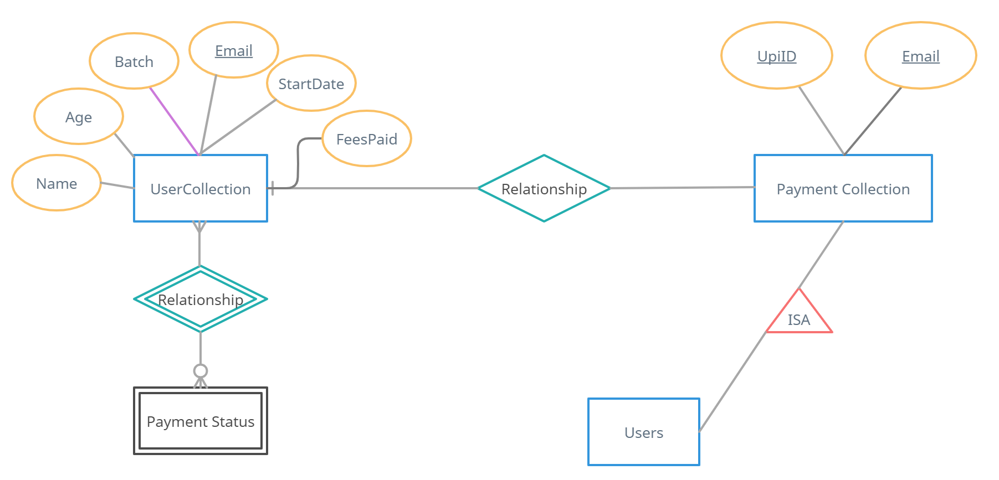

# HOSTED LINK

## https://yogaenrollform.netlify.app/

## SERVER
TECH USED : MONGODBH, EXPRESSJS, REACTJS, NODEJS (MERN).

## HOW TO RUN
  
  1) clone the repo to vscode
  2) Open the terminal and split them
  3) change the working directories to cd client & cd server
  4) npm install in both enviroinments
  5) npm start for client to start the server on localhost
  6) npm run dev for server to connect to the database virtually
  
## APPROACH

   So the approach we are following here is :

   ## USER REGISTRATION
      
      1)  The Home page shows the form structure
         1.1) Collects the data and stores in the database:
            a) shows user alraedy exist if duplicated
         1.2) New user : We would create a new entry in our db for the user

         In both the above case we have put a check that age should be greater than 18 and less than 65
        
  ## SLOT BOOKING

     2) Now user will register for a slot
        2.1) If the user has already booked a slot in the curr month then we ask them to come in next month
        2.2) If the user is booking the slot for the first time in the month than we will update the batch and date

   ## PAYMENT

    3) Collects all the details of payment i.e card num, card holder, cvv, expiry date all uses Completepayment() mock function to complete payment.
        3.1) Shows the successful payment page and user details for confirmation.
        3.2) The users card info is not stored in the database.

## ER DIAGRAM

## MONGODB SCHEMA

## SCREENSHOTS

